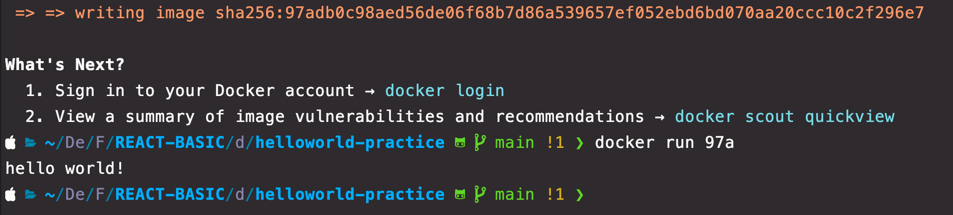

# 1. 도커를 사용하는 이유
- 어떤 프로그램을 다운로드 받는 과정을 간단하게 만들기 위함

### 도커 없이 프로그램을 받을 때 원래 프로그램을 다운받고 실행하는 순서
1. 인스톨러 내려받기
2. 인스톨러 실행
3. 프로그램 설치 완료

- 위의 방식대로 하면 에러가 종종 발생한다
    - OS 등이 다르면 다운로드 받는 방법이 달라지기 때문
- 도커를 이용하면 설치 과정도 간단해지고 예상하지 못하는 에러가 발생하지 않는다
  - 필수 사항은 아니지만 선택 사항으로 좋은 선택이 될 수 있음

---
# 2. 도커란 무엇인가?
- 컨테이너를 사용해서 응용 프로그램을 더 쉽게 만들고 배포하고 실행할 수 있도록 설꼐된 도구
- 컨테이너 기반의 오픈소스 가상화 플랫폼이며 생태계다.

## 서버에서 컨테이너의 개념
- 컨테이너 안에 다양한 프로그램, 실행 환경을 컨테이너로 추상화하고 동일한 인터페이스를 제공하여 프로그램의 배포 및 관리를 단순하게 한다
- 프로그램을 쉽게 이동 배포 관리를 할 수 있게 해준다.
- AWS, Azure, Google Cloud 등 어디에서든 실행 가능하게 한다.

---
# 3. 도커를 사용할 때의 흐름 감잡기
- 도커를 사용할 때는
 1. 도커 CLI 에 커맨드를 입력하낟.
 2. 도커 서버(도커 Daemon)이 그 커맨드를 받아서 그것에 따라 이미지를 생성하든 컨테이너를 실행하든 모든 작업을 하게 된다.

`$ docekr run hello-world`
1. 도커 클라이언트에 커맨드를 입력하니 클라이언트에서 도커 서버로 요청을 보냄
2. 서버에서 hello-world 라는 이미지가 이미 로컬에 cache 돼 있는지를 확인
3. 현재 없으므로 Unable to find image 라는 문구가 두 번째 줄에 표시 
4. 다음으로 Docker Hub 라는 이미지가 저장된 곳에 가서 그 이미지를 가져오고 로컬에 Cache 로 보관 
5. 이제 이미지가 있으니 그 이미지를 이용해 컨테이너를 생성 
6. 이미지로 생성된 컨테이너는 이미지에서 받은 설정이나 조건에 따라 프로그램을 실행

---
# 4. 이미지로 컨테이너 만들기
- 이미지는 응용 프로그램을 실행하는데 필요한 모든 것을 포함한다.
- 필요한 것이란?
  - 컨테이너가 시작될 때 실행되는 명령어 (ex: run kakaotalk)
  - 파일 스냅샷 (디렉토리나 파일을 카피한 것. 실행하는데 필요한 파일)

## 4-1) 이미지로 컨테이너를 만드는 순서
1. Docker 클라이언트에 `docker run <이미지>` 를 입력
2. 도커 이미지에 있는 파일 스냅샷을 컨테이너 하드 디스크에 옮긴다.
   - 파일 스냅샷으로 `hello-world` 설치에 필요한 파일을 하드 디스크에 넣는다
3. 이미지에서 갖고 있는 명령어(컨테이너가 실행될 때 사용될 명령어)를 이용해서 프로그램을 실행시킨다.
   - `run hello-world` 로 명령어를 컨테이너에서 실행한다.
   - 해당 명령어가 커널을 통해서 실행되고 하드디스크에 저장된 파일을 실행한다

---
# 5. 도커 이미지를 생성하는 순서
- 현재까지는 도커 이미지를 도커 허브에 이미 존재하는 것들만 가져와서 사용해봄
- 하지만 직접 도커 이미지를 만들어서 사용할 수도 있고, 허브에 올려 공유할 수 있다.

## 5-1) 간단한 복습
1. 도커 이미지는 컨테이너를 만들기 위해 필요한 설정이나 종속성들을 갖고 있는 소프트웨어 패키지
2. 도커 이미지는 Dockerhub 에 이미 다른 사람이 만든 것을 이용할 수도, 혹은 직접 사용할 수도 있다.

- 도커 이미지를 이용해서 도커 컨테이너를 생성할 때는 `docker create <이미지_이름>` 을 사용한다

## 5-2) 도커 이미지 생성하는 순서
1. 도커 파일 작성
   - 도커 파일이란 도커 이미지를 만들기 위한 설정 파일
   - 컨테이너가 어떻게 행동해야 하는지에 대한 설정을 정의한다.
2. 도커 클라이언트
   - 도커 파일에 입력된 명령들이 도커 클라이언트에 전달돼야 한다.
3. 도커 서버
   - 도커 클라이언트에 전달된 모든 중요한 작업을 진행하는 곳
4. 이미지 생성

--- 
# 6. Docker file 만들기
## 6-1) 도커 파일(Docker file) 이란?
- 도커 이미지를 만들기 위한 설정 파일
- 컨테이너가 어떻게 행동해야 하는지에 대한 설정을 정의하는 곳

## 6-2) 도커 파일 만드는 순서
- 도커 이미지가 필요한 것이 무엇인지를 생각하기
1. 베이스 이미지를 명시한다(파일 스냅샷)
2. 추가적으로 필요한 파일을 다운 받기 위한 몇 가지 명령어를 재시한다 (파일 스냅샷에 해당)
3. 컨테이너 시작 시, 실행될 명령어를 명시해준다. (시작 시 실행될 명령어에 해당)

### 베이스 이미지란?
- 도커 이미지는 여러 레이어들로 돼있다.
- 그 중, 베이스 이미지는 이 이미지의 기반이 되는 부분이다.
  - 간단하게 OS 라고 생각하면 된다.
- 만약, 이 이미지에 추가한다면 레이어가 이미지에 추가된다. (레이어 캐싱)

## 6-3) 실습
> "hello" 출력하기 (./helloworld-practice)

1. 도커 파일을 만들 폴더 하나 만들기
2. 방금 생성한 도커 파일 폴더를 에디터를 이용해서 실행하기
3. dockerfile 이라는 이름의 파일을 생성하게
4. 그 안에 먼저 어떻게 진행할지 기본적인 베이스를 명시
  - `FROM` : 이미지 생성시 기반이 되는 이미지 레이어.<이미지_이름>:<태그> 형식으로 작성
  - `RUN` : 이미지가 생성되기 전에 수행할 쉘 명령어
  - `CMD` : 컨테이너가 시작되었을 때 실행할 실행 파일 또는 쉘 스크립트 (dockerfile 내 1회만 작성 가능)
5. 베이스 이미지로부터 실제 값을 추가한다
6. 베이스 이미지는 Ubuntu 를 써도 되고, centos 등을 써도 된다.
   - hello 를 출력하는 기능에서는 굳이 사이즈가 큰 베이스 이미지를 쓰지 않아도 되므로 사이즈 작은 alpine 을 사용
7. hello 문자를 출력하기 위해 echo 를 사용해야 하는데, alpine 내부에 echo 가 사용이 가능하므로 `RUN` 은 생략한다
8. 컨테이너 시작 시 실행될 명령어 echo hello 를 적는다.

---

# 7. 도커 파일로 도커 이미지 만들기
- 도커 파일에 입력된 것들이 도커 클라이언트에 전달되어 도커 서버가 인식하게 만들어야 한다.
- `docker build ./` 를 입력해야 한다.
  - 위 명령어는 해당 디렉토리 내에 dockerfile 을 찾아서 도커 클라이언트에 전달한다.

### 빌드 과정
1. alpine 이미지를 먼저 가져온다.
2. 임시 컨테이너를 생성하고 컨테이너 시작 시 사용할 명령어를 포함시킨다.
   - 하드 디스크에파일 시스템 스냅샷을 추가
   - 이후, 시작 시 실행할 명령어를 추가.
3. 방금 생성한 임시 컨테이너를 지우고 새로운 이미지를 만든다.

## 결론
- 베이스 이미지에서 다른 종속성이나 새로운 커맨드를 추가할 때는 임시 컨테이너를 만든다.
- 그 컨테이너를 토대로 이미지를 만든다.
- 이후, 임시 컨테이너를 지운다.

