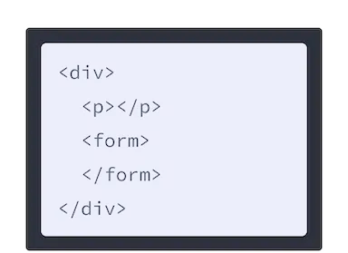
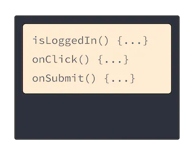
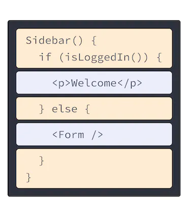
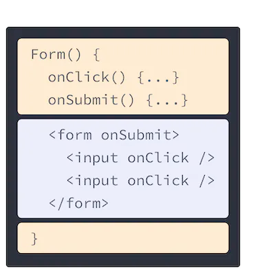

# JSX 로 마크업 작성하기
- JSX 는 JavaScript 를 확장한 문법이다.
- 컴포넌트를 작성하는 방법에는 JSX 가 아닌 것도 존재하지만(createElement 등) 대부분은 JSX 를 선호한다


# 1. JSX : JavaScript 마크업 넣기
- 웹은 HTML, CSS, JS 기반으로 만들어져 왔다
- 보통은 각기 분리된 파일로 관리를 했지만 앱이 사용자와 상호직용을 많이 하게 되면서 JS 가 HTML 을 많이 담당하게 됐다
- 이것이 React 에서 렌더링 로직과 마크업이 같은 위치의 컴포넌트에 함께 있는 이유

### 기존


### React 컴포넌트 사용 후
 

- 위처럼 마크업 언어와 렌더링 로직이 함게 존재하기 때문에 사용되는 모든 곳에서 동기화 상태를 유지할 수 있다.
- 하지만, 사이드바의 마크업처럼 서로 관련 없는 항목들은 서로 분리돼 있어 개별적으로 변경하는 것이 더 안전하다.

## React 컴포넌트는 함수다
- 리액트 컴포넌트는 리액트가 브라우저에 마크업을 렌더링할 수 있게 하는 JavaScript 함수다.
  - JSX 라는 구문확장자를 사용해 해당하는 마크업을 표현한다.
	- 그러나 JSX 	와 리액트는 별개의 개념이므로 항상 같이 있는 것은 아니다

# 2. HTML을 JSX 로 변환하기
```html
<h1>Hedy Lamarr's Todos</h1>

<ul>
	<li>Invent new traffic lights
	<li>Rehearse a movie scene
	<li>Improve the spectrum technology
</ul>
```
- 위의 HTML 마크업을 컴포넌트로 만들면 어떻게 될까?
```typescript jsx
export default function TodoList() {
  return (
    // This doesn't quite work!
    <h1>Hedy Lamarr's Todos</h1>
    
    <ul>
      <li>Invent new traffic lights
      <li>Rehearse a movie scene
      <li>Improve the spectrum technology
    </ul>
  )
}
```
- 안타깝게도 에러를 반환한다.
- JSX 는 HTML 보다 더 엄격하며 몇가지 규칙이 더 존재한다.
- 그러나 대부분 JSX 문법 오류는 화면에서 상세하게 에러가 난 이유를 설명하므로 쉽게 해결할 수는 있다.

# 3. JSX 규칙
## 3-1) 단일 루트 엘리먼트를 반환하라.
- 컴포넌트가 여러 엘리먼트를 반환한다 해도, 무조건 하나의 부모 태그로 감싸야 한다.
	- 가장 무난한 <div></div> 태그 혹은, <></> React Fragment 태그를 사용할 수 있다
  - 이 Fragment 는 HTML 트리 구조에서 흔적을 남기지 않고 그룹핑한다.
```typescript jsx
export default function TodoList() {
  return (
		<>
			<h1>Hedy Lamarr's Todos</h1>
			
			<ul>
				<li>Invent new traffic lights
				<li>Rehearse a movie scene
				<li>Improve the spectrum technology
			</ul>
		</>
  )
}
```
- 이렇게 단일 태그로 감싸줘야 하는 이유는?
  - JSX 는 HTML 처럼 보이지만 내부적으로는 JavaScript 객체다
  - 하나의 배열로 감싸지 않은 하나의 함수에서는 두 개의 객체를 반환할 수 없다
  - 그러므로, 또 다른 태그나 Fragment 로 감싸지 않으면 JSX 태그를 반환할 수 없다
- 하지만 이렇게 해서도 아직 위의 컴포넌트는 에러를 발생시킬 것이다

## 3-2) 모든 태그를 닫아라
- JSX 에서 태그는 명시적으로 닫아야 한다.
```typescript jsx
export default function TodoList() {
  return (
		<>
			<h1>Hedy Lamarr's Todos</h1>
			
			<ul>
				<li>Invent new traffic lights</li>
				<li>Rehearse a movie scene</li>
				<li>Improve the spectrum technology</li>
			</ul>
		</>
  )
}
```
- 만약 자체적으로 closing 인 태그는 반드시  이런 식으로 작성해야 한다.

## 3-3) 대부분이 카멜 케이스다
- JSX 는 자바스크립트로 바뀌고, JSX 로 작성된 속성은 자바스크립트 객체의 키가 된다
- 그래서 속성에 대쉬(-)를 쓰지 않고, 자바스크립트 예약어(class) 를 사용하지 않는다
```typescript jsx

```
- 이런 속성을 잘못 쓰는 경우가 있다 해도, 어차피 에러로 친절하게 설명해주어 대부분 금방 해결이 가능하다
